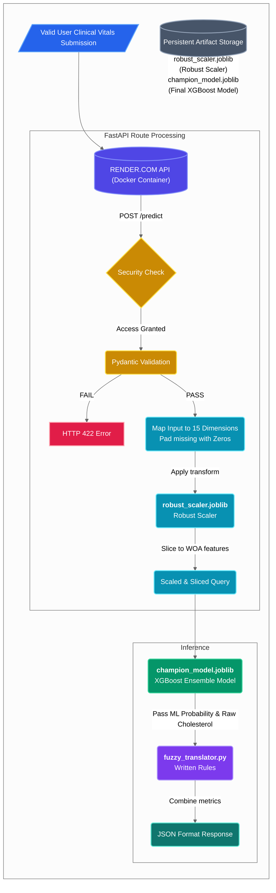
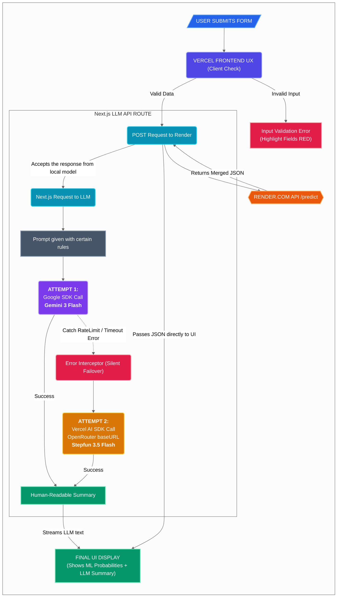

```mermaid
%%{init: {'theme': 'neutral'}}%%
graph TD
    subgraph PRODUCTION_PIPELINE [" "]
        direction TB
        UserQuery[/"Valid User Clinical Vitals Submission"/]:::query --> RenderAPI[("RENDER.COM API (Docker Container)")]:::api

        Storage[("Persistent Artifact Storage")]:::storage -.->|"robust_scaler.joblib<br/>(Robust Scaler)<br/>champion_model.joblib<br/>(Final XGBoost Model)"| FASTAPI

        subgraph FASTAPI ["FastAPI Route Processing"]
            direction TB
            RenderAPI -->|"POST /predict"| APIKey{"Security Check"}:::key
            
            APIKey -->|"Access Granted"| PydanticCheck("Pydantic Validation"):::key
            PydanticCheck -->|"FAIL"| HttpError["HTTP 422 Error"]:::fail
            
            PydanticCheck -->|"PASS"| DataMapping("Map Input to 15 Dimensions<br/>Pad missing with Zeros"):::scaler
            DataMapping -->|"Apply transform"| ScalerGate("<b>robust_scaler.joblib</b></br>Robust Scaler"):::scaler
            ScalerGate -->|"Slice to WOA features"| SlicedData("Scaled & Sliced Query"):::scaler
        end

        subgraph INFERENCE ["Inference"]
            direction TB
            XGBoost_joblib("<b>champion_model.joblib</b><br/>XGBoost Ensemble Model"):::brainxg
            XGBoost_joblib -->|"Pass ML Probability & Raw Cholesterol"| Fuzzy_py("<b>fuzzy_translator.py</b><br/>Written Rules"):::brainfuzzy
            Fuzzy_py -->|"Combine metrics"| JsonOutput("JSON Format Response"):::merged
        end

        %% By moving this connection OUTSIDE the subgraphs, 
        %% Mermaid will route it cleanly without striking through the heading.
        SlicedData --> XGBoost_joblib
    end

    %% Colorful Styling definitions
    classDef storage fill:#475569,stroke:#94a3b8,stroke-width:2px,color:#fff;
    classDef query fill:#2563eb,stroke:#60a5fa,stroke-width:2px,color:#fff;
    classDef api fill:#4f46e5,stroke:#818cf8,stroke-width:2px,color:#fff;
    classDef key fill:#ca8a04,stroke:#fde047,stroke-width:2px,color:#fff;
    classDef fail fill:#e11d48,stroke:#fda4af,stroke-width:2px,color:#fff;
    classDef scaler fill:#0891b2,stroke:#67e8f9,stroke-width:2px,color:#fff;
    classDef brainxg fill:#059669,stroke:#34d399,stroke-width:2px,color:#fff;
    classDef brainfuzzy fill:#7c3aed,stroke:#a78bfa,stroke-width:2px,color:#fff;
    classDef merged fill:#0f766e,stroke:#5eead4,stroke-width:2px,color:#fff;
```

```mermaid
%%{init: {'theme': 'neutral'}}%%
graph TD
    subgraph WEB_APP [" "]
        direction TB
        UserInteraction[/"USER SUBMITS FORM"/]:::query --> Vercel_UX("VERCEL FRONTEND UX (Client Check)"):::ux
        
        Vercel_UX -->|"Invalid Input"| RedUI["Input Validation Error<br/>(Highlight Fields RED)"]:::fail
        Vercel_UX -->|"Valid Data"| BackendCall("POST Request to Render"):::route
        
        BackendCall --> RenderAPI{{"RENDER.COM API /predict"}}:::api
        RenderAPI -->|"Returns Merged JSON"| BackendCall

        subgraph LLM_LOOP ["Next.js LLM API ROUTE"]
            direction TB
            LLM_Route("Next.js Request to LLM"):::route
            PromptMandate["Prompt given with certain rules"]:::mandate
            
            BackendCall -->|"Accepts the response from local model"| LLM_Route
            LLM_Route --> PromptMandate
            
            PromptMandate --> Attempt1("<b>ATTEMPT 1:</b><br/>Google SDK Call<br/><b>Gemini 3 Flash</b>"):::gemini
            
            Attempt1 -->|"Success"| SuccessRes["Human-Readable Summary"]:::emerald
            Attempt1 -.->|"Catch RateLimit / Timeout Error"| CatchBlock("Error Interceptor (Silent Failover)"):::fail
            
            CatchBlock --> Attempt2("<b>ATTEMPT 2:</b><br/>Vercel AI SDK Call<br/>OpenRouter baseURL<br/><b>Stepfun 3.5 Flash</b>"):::stepfun
            Attempt2 -->|"Success"| SuccessRes
        end

        %% The dual-data stream into the final UI
        SuccessRes -->|"Streams LLM text"| Display["FINAL UI DISPLAY<br/>(Shows ML Probabilities + LLM Summary)"]:::emerald
        BackendCall -->|"Passes JSON directly to UI"| Display
    end

    %% Colorful Styling definitions
    classDef query fill:#2563eb,stroke:#60a5fa,stroke-width:2px,color:#fff;
    classDef ux fill:#4f46e5,stroke:#818cf8,stroke-width:2px,color:#fff;
    classDef fail fill:#e11d48,stroke:#fda4af,stroke-width:2px,color:#fff;
    classDef route fill:#0891b2,stroke:#22d3ee,stroke-width:2px,color:#fff;
    classDef api fill:#ea580c,stroke:#fdba74,stroke-width:2px,color:#fff;
    classDef mandate fill:#475569,stroke:#94a3b8,stroke-width:2px,color:#fff;
    classDef gemini fill:#7c3aed,stroke:#c4b5fd,stroke-width:2px,color:#fff;
    classDef stepfun fill:#d97706,stroke:#fcd34d,stroke-width:2px,color:#fff;
    classDef emerald fill:#059669,stroke:#6ee7b7,stroke-width:2px,color:#fff;
```
