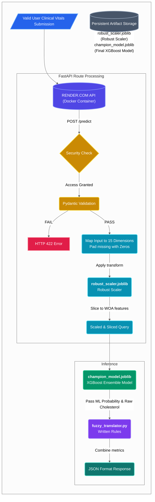
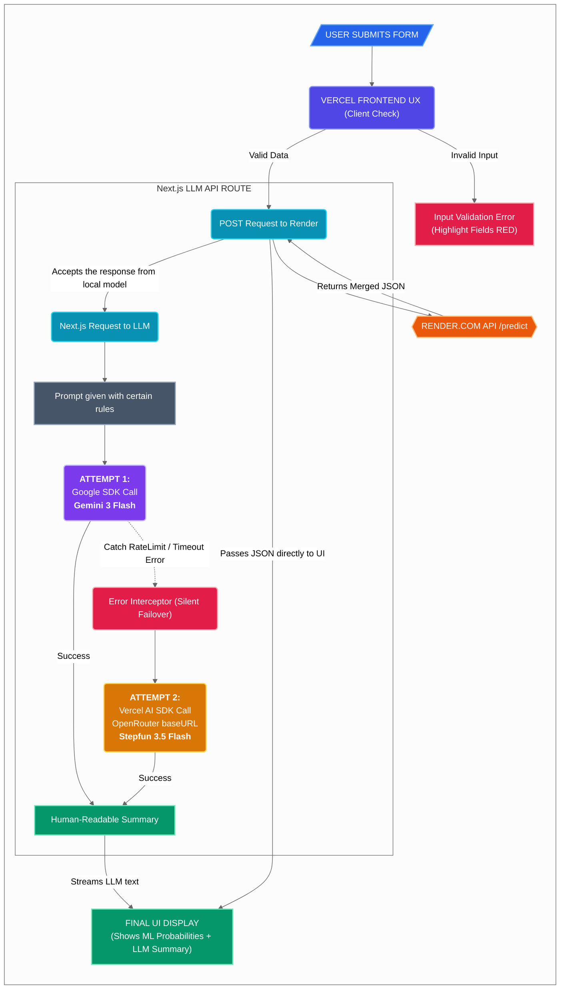
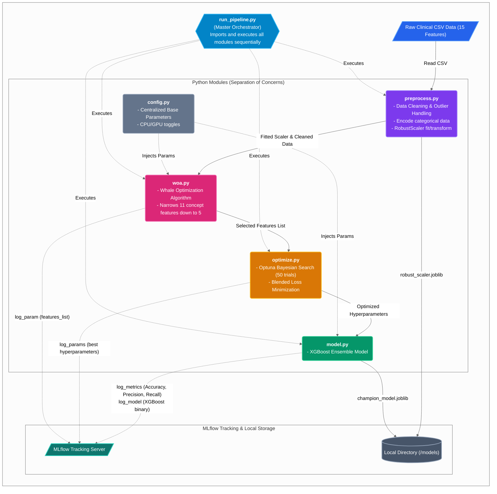

# 🫀 Predictive Heart Intelligence

A Full-Stack, highly resilient Clinical AI Platform. This project transforms raw cardiovascular data into actionable clinical insights using a modular Machine Learning pipeline, a deterministic Fuzzy Logic safety net, and a Generative AI failover circuit breaker.

---

## 🏗️ System Architecture

This system is built on a strict "Separation of Concerns" philosophy, divided into three core pipelines:

### 1. The MLOps & Training Pipeline (Offline)
Replaced messy Jupyter Notebooks with a highly modular Python architecture:
* **Dimensionality Reduction (`woa.py`):** Utilizes the meta-heuristic Whale Optimization Algorithm (WOA) to aggressively filter 15 clinical features down to the 5 most critical predictive signals.
* **Hyperparameter Tuning (`optimize.py`):** Uses Optuna (Bayesian Search) to minimize a custom blended loss function (balancing AUC, F1, and feature cost).
* **Orchestration (`run_pipeline.py`):** Automates the ingestion, preprocessing (Robust Scaling), tuning, and training of the XGBoost ensemble model.
* **Tracking:** Fully integrated with **MLflow** to log parameters, metrics, and model binaries locally.

### 2. The Production Inference Engine (FastAPI & Docker)
A lightweight, containerized Python backend deployed via Render.com:
* **Defense in Depth:** Uses **Pydantic** to enforce strict mathematical boundaries on incoming clinical vitals, preventing "Garbage In, Garbage Out".
* **Dual-Brain Inference:** 1.  Calculates exact disease probability using the tuned **XGBoost** model.
    2.  Passes the probability and raw cholesterol through a **Scikit-Fuzzy** expert system. This deterministic logic engine overrides the ML model with a "Warning" or "Critical" score if biologically dangerous outliers are detected.

## 🛠️ Tech Stack

* **Machine Learning:** XGBoost, Scikit-Learn, Scikit-Fuzzy, pyMetaheuristic (WOA), Optuna
* **MLOps:** MLflow, Joblib, Pandas, NumPy
* **Backend:** FastAPI, Uvicorn, Pydantic, Python 3.10-slim
* **Infrastructure:** Docker, Render.com

---

## 🚀 Local Installation & Setup

### Prerequisites
* Python 3.10+
* Docker Desktop (Optional, for containerized running)
* Node.js 18+ (For Frontend)

